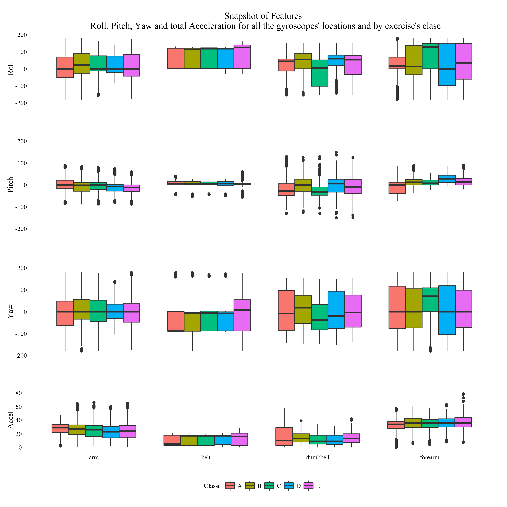
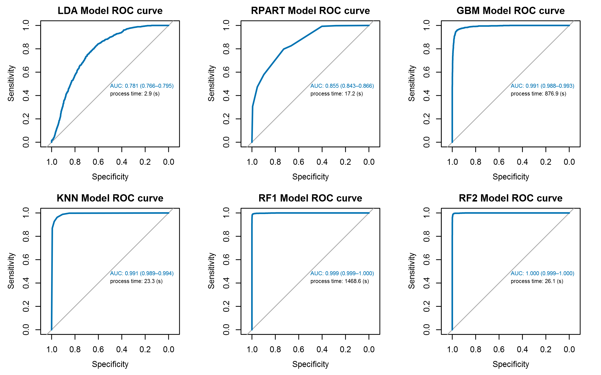

# Machine Learning writeup
Eduardo B. Diez --- August 2014  
   

## Introduction

This document explaining how we chose the forecast for 20 cases about the way in which six participants do exercises according to data [from this link](http://groupware.les.inf.puc-rio.br/har#weight_lifting_exercises) to finally submit the forecast as the final part of the project.

We'll talk of the predictors that were selected as "features" to develop the model and about the various training methods we used whose results were compared and provided aid to make the final decision based on the accuracy they showed.

The goal of your project is to predict the manner in which they did the exercise. 
This is the "classe" variable in the training set. 

You may use any of the other variables to predict with. 
You should create a report describing 

1. how you built your model, 

2. how you used cross validation, 

3. what you think the expected out of sample error is, 

4. and why you made the choices you did.

You will also use your prediction model to predict
20 different test cases.

1 Has the student submitted a github repo?

2 Do the authors describe what they expect the out of sample error to be and estimate the
error appropriately with cross-validation?
r: 
Trading off goodness of fit against model complexity
• If the model has as many degrees of
freedom as the data, it can fit the
training data perfectly
• But the objective in ML is generalization
• Can expect a model to generalize well if it explains the training data
surprisingly well given the complexity of the model

## The Data and Features

In this project we will use data from four accelerometers on the belt, forearm, arm, and dumbell of six participants. They were asked to perform barbell lifts correctly and incorrectly in 5 different ways. So, the data contain the raw information from the gyroscopes and also some variables derivates from the raw as mean, standard deviation among other few.

After the inspection and work around with the data we arrive to the conclusion that the variables we can understand as real features with added value to be used to model the problem effectively are those about roll, yaw, pitch and total acceleration that correspond with each of the four locations where the gyroscopes are registering the movements.

After removal the other variables, we proceeded to the proper ordering of the remaining to present them graphically, so one can easily detect any anomaly that may exist and whereafter was computed the correlation between them. The variable **roll_bell** was found correlated with other two of them thus, we decided to eliminate it from the dataset.

Below we show the 15 variables with which we make our model

<table class='gmisc_table' style='border-collapse: collapse;' >
	<thead>
	<tr><td colspan='2' style='text-align: left;'>
	</td></tr>
	<tr>
		<th style='font-weight: 900; border-bottom: 1px solid grey; border-top: 2px solid grey;'>#</th>
		<th style='border-bottom: 1px solid grey; border-top: 2px solid grey; text-align: center;'>Feature</th>
	</tr>
	</thead><tbody>
	<tr>
		<td style='text-align: center;'>1</td>
		<td style='text-align: center;'>pitch_belt</td>
	</tr>
	<tr>
		<td style='text-align: center;'>2</td>
		<td style='text-align: center;'>yaw_belt</td>
	</tr>
	<tr>
		<td style='text-align: center;'>3</td>
		<td style='text-align: center;'>total_accel_belt</td>
	</tr>
	<tr>
		<td style='text-align: center;'>4</td>
		<td style='text-align: center;'>roll_arm</td>
	</tr>
	<tr>
		<td style='text-align: center;'>5</td>
		<td style='text-align: center;'>pitch_arm</td>
	</tr>
	<tr>
		<td style='text-align: center;'>6</td>
		<td style='text-align: center;'>yaw_arm</td>
	</tr>
	<tr>
		<td style='text-align: center;'>7</td>
		<td style='text-align: center;'>total_accel_arm</td>
	</tr>
	<tr>
		<td style='text-align: center;'>8</td>
		<td style='text-align: center;'>roll_dumbbell</td>
	</tr>
	<tr>
		<td style='text-align: center;'>9</td>
		<td style='text-align: center;'>pitch_dumbbell</td>
	</tr>
	<tr>
		<td style='text-align: center;'>10</td>
		<td style='text-align: center;'>yaw_dumbbell</td>
	</tr>
	<tr>
		<td style='text-align: center;'>11</td>
		<td style='text-align: center;'>total_accel_dumbbell</td>
	</tr>
	<tr>
		<td style='text-align: center;'>12</td>
		<td style='text-align: center;'>roll_forearm</td>
	</tr>
	<tr>
		<td style='text-align: center;'>13</td>
		<td style='text-align: center;'>pitch_forearm</td>
	</tr>
	<tr>
		<td style='text-align: center;'>14</td>
		<td style='text-align: center;'>yaw_forearm</td>
	</tr>
	<tr>
		<td style='border-bottom: 2px solid grey; text-align: center;'>15</td>
		<td style='border-bottom: 2px solid grey; text-align: center;'>total_accel_forearm</td>
	</tr>
	</tbody>
	<tfoot><tr><td colspan='2'>
	Summary of predictors to use.</td></tr></tfoot>
</table>

Finally we confirm that `roll_bell` was correlated with two other features therefore was remove, giving the final features as: 

                  

## The machineries

## The Results

We can check the statistics values of the models we've run

<table class='gmisc_table' style='border-collapse: collapse;' >
	<thead>
	<tr><td colspan='6' style='text-align: left;'>
	Table 1. Confussion Matrix Statistics of Dual RF2&dagger; model</td></tr>
	<tr>
		<th style='font-weight: 900; border-bottom: 1px solid grey; border-top: 2px solid grey;'>randomForest()</th>
		<th style='border-bottom: 1px solid grey; border-top: 2px solid grey; text-align: center;'>Class: A</th>
		<th style='border-bottom: 1px solid grey; border-top: 2px solid grey; text-align: center;'>Class: B</th>
		<th style='border-bottom: 1px solid grey; border-top: 2px solid grey; text-align: center;'>Class: C</th>
		<th style='border-bottom: 1px solid grey; border-top: 2px solid grey; text-align: center;'>Class: D</th>
		<th style='border-bottom: 1px solid grey; border-top: 2px solid grey; text-align: center;'>Class: E</th>
	</tr>
	</thead><tbody>
	<tr>
		<td style='text-align: left;'>Sensitivity</td>
		<td style='text-align: center;'>0.99</td>
		<td style='text-align: center;'>0.99</td>
		<td style='text-align: center;'>0.96</td>
		<td style='text-align: center;'>0.98</td>
		<td style='text-align: center;'>1.00</td>
	</tr>
	<tr>
		<td style='text-align: left;'>Specificity</td>
		<td style='text-align: center;'>1.00</td>
		<td style='text-align: center;'>0.99</td>
		<td style='text-align: center;'>1.00</td>
		<td style='text-align: center;'>1.00</td>
		<td style='text-align: center;'>1.00</td>
	</tr>
	<tr>
		<td style='text-align: left;'>Pos Pred Value</td>
		<td style='text-align: center;'>0.99</td>
		<td style='text-align: center;'>0.97</td>
		<td style='text-align: center;'>0.98</td>
		<td style='text-align: center;'>0.99</td>
		<td style='text-align: center;'>0.99</td>
	</tr>
	<tr>
		<td style='text-align: left;'>Neg Pred Value</td>
		<td style='text-align: center;'>1.00</td>
		<td style='text-align: center;'>1.00</td>
		<td style='text-align: center;'>0.99</td>
		<td style='text-align: center;'>1.00</td>
		<td style='text-align: center;'>1.00</td>
	</tr>
	<tr>
		<td style='text-align: left;'>Prevalence</td>
		<td style='text-align: center;'>0.28</td>
		<td style='text-align: center;'>0.19</td>
		<td style='text-align: center;'>0.18</td>
		<td style='text-align: center;'>0.16</td>
		<td style='text-align: center;'>0.18</td>
	</tr>
	<tr>
		<td style='text-align: left;'>Detection Rate</td>
		<td style='text-align: center;'>0.28</td>
		<td style='text-align: center;'>0.19</td>
		<td style='text-align: center;'>0.17</td>
		<td style='text-align: center;'>0.16</td>
		<td style='text-align: center;'>0.18</td>
	</tr>
	<tr>
		<td style='text-align: left;'>Detection Prevalence</td>
		<td style='text-align: center;'>0.28</td>
		<td style='text-align: center;'>0.19</td>
		<td style='text-align: center;'>0.17</td>
		<td style='text-align: center;'>0.16</td>
		<td style='text-align: center;'>0.18</td>
	</tr>
	<tr>
		<td style='border-bottom: 2px solid grey; text-align: left;'>Balanced Accuracy</td>
		<td style='border-bottom: 2px solid grey; text-align: center;'>1.00</td>
		<td style='border-bottom: 2px solid grey; text-align: center;'>0.99</td>
		<td style='border-bottom: 2px solid grey; text-align: center;'>0.98</td>
		<td style='border-bottom: 2px solid grey; text-align: center;'>0.99</td>
		<td style='border-bottom: 2px solid grey; text-align: center;'>1.00</td>
	</tr>
	</tbody>
	<tfoot><tr><td colspan='6'>
	&dagger; The predictions of this model achieved a score of 20 / 20 in the submission part of the project, same as RF1 and KNN models.</td></tr></tfoot>
</table>

This boosting method do ...

<table class='gmisc_table' style='border-collapse: collapse;' >
	<thead>
	<tr><td colspan='6' style='text-align: left;'>
	Table 2. Confussion Matrix Statistics of Boosting GBM&Dagger; model</td></tr>
	<tr>
		<th style='font-weight: 900; border-bottom: 1px solid grey; border-top: 2px solid grey;'>method='gbm'</th>
		<th style='border-bottom: 1px solid grey; border-top: 2px solid grey; text-align: center;'>Class: A</th>
		<th style='border-bottom: 1px solid grey; border-top: 2px solid grey; text-align: center;'>Class: B</th>
		<th style='border-bottom: 1px solid grey; border-top: 2px solid grey; text-align: center;'>Class: C</th>
		<th style='border-bottom: 1px solid grey; border-top: 2px solid grey; text-align: center;'>Class: D</th>
		<th style='border-bottom: 1px solid grey; border-top: 2px solid grey; text-align: center;'>Class: E</th>
	</tr>
	</thead><tbody>
	<tr>
		<td style='text-align: left;'>Sensitivity</td>
		<td style='text-align: center;'>0.97</td>
		<td style='text-align: center;'>0.88</td>
		<td style='text-align: center;'>0.86</td>
		<td style='text-align: center;'>0.92</td>
		<td style='text-align: center;'>0.95</td>
	</tr>
	<tr>
		<td style='text-align: left;'>Specificity</td>
		<td style='text-align: center;'>0.98</td>
		<td style='text-align: center;'>0.97</td>
		<td style='text-align: center;'>0.98</td>
		<td style='text-align: center;'>0.99</td>
		<td style='text-align: center;'>0.99</td>
	</tr>
	<tr>
		<td style='text-align: left;'>Pos Pred Value</td>
		<td style='text-align: center;'>0.96</td>
		<td style='text-align: center;'>0.86</td>
		<td style='text-align: center;'>0.90</td>
		<td style='text-align: center;'>0.94</td>
		<td style='text-align: center;'>0.93</td>
	</tr>
	<tr>
		<td style='text-align: left;'>Neg Pred Value</td>
		<td style='text-align: center;'>0.99</td>
		<td style='text-align: center;'>0.97</td>
		<td style='text-align: center;'>0.97</td>
		<td style='text-align: center;'>0.98</td>
		<td style='text-align: center;'>0.99</td>
	</tr>
	<tr>
		<td style='text-align: left;'>Prevalence</td>
		<td style='text-align: center;'>0.28</td>
		<td style='text-align: center;'>0.19</td>
		<td style='text-align: center;'>0.18</td>
		<td style='text-align: center;'>0.17</td>
		<td style='text-align: center;'>0.18</td>
	</tr>
	<tr>
		<td style='text-align: left;'>Detection Rate</td>
		<td style='text-align: center;'>0.27</td>
		<td style='text-align: center;'>0.17</td>
		<td style='text-align: center;'>0.16</td>
		<td style='text-align: center;'>0.15</td>
		<td style='text-align: center;'>0.17</td>
	</tr>
	<tr>
		<td style='text-align: left;'>Detection Prevalence</td>
		<td style='text-align: center;'>0.28</td>
		<td style='text-align: center;'>0.19</td>
		<td style='text-align: center;'>0.17</td>
		<td style='text-align: center;'>0.16</td>
		<td style='text-align: center;'>0.18</td>
	</tr>
	<tr>
		<td style='border-bottom: 2px solid grey; text-align: left;'>Balanced Accuracy</td>
		<td style='border-bottom: 2px solid grey; text-align: center;'>0.97</td>
		<td style='border-bottom: 2px solid grey; text-align: center;'>0.93</td>
		<td style='border-bottom: 2px solid grey; text-align: center;'>0.92</td>
		<td style='border-bottom: 2px solid grey; text-align: center;'>0.95</td>
		<td style='border-bottom: 2px solid grey; text-align: center;'>0.97</td>
	</tr>
	</tbody>
	<tfoot><tr><td colspan='6'>
	&Dagger; The predictions of this model  achieved a score of 19 / 20 in the submission part of the project.</td></tr></tfoot>
</table>
 

<table class='gmisc_table' style='border-collapse: collapse;' >
	<thead>
	<tr><td colspan='8' style='text-align: left;'>
	Table 3. Summary of Kappas & Accuracies</td></tr>
	<tr>
		<th style='border-top: 2px solid grey;'></th>
		<th colspan='2' style='font-weight: 900; border-top: 2px solid grey; text-align: center;'></th><th style='border-top: 2px solid grey;; border-bottom: hidden;'>&nbsp;</th>
		<th colspan='2' style='font-weight: 900; border-bottom: 1px solid grey; border-top: 2px solid grey;'>Accuracy CI</th><th style='border-top: 2px solid grey;; border-bottom: hidden;'>&nbsp;</th>
		<th colspan='1' style='font-weight: 900; border-bottom: 1px solid grey; border-top: 2px solid grey;'>Submission</th>
	</tr>
	<tr>
		<th style='font-weight: 900; border-bottom: 1px solid grey; '>method</th>
		<th style='border-bottom: 1px solid grey; text-align: center;'>Kappa</th>
		<th style='border-bottom: 1px solid grey; text-align: center;'>Accuracy</th>
		<th style='border-bottom: 1px solid grey;' colspan='1'>&nbsp;</th>
		<th style='border-bottom: 1px solid grey; text-align: center;'>L: 2.5%</th>
		<th style='border-bottom: 1px solid grey; text-align: center;'>U: 97.5%</th>
		<th style='border-bottom: 1px solid grey;' colspan='1'>&nbsp;</th>
		<th style='border-bottom: 1px solid grey; text-align: center;'>Score</th>
	</tr>
	</thead><tbody>
	<tr>
		<td style='text-align: left;'>LDA</td>
		<td style='text-align: center;'>0.3088</td>
		<td style='text-align: center;'>0.4560</td>
		<td style='' colspan='1'>&nbsp;</td>
		<td style='text-align: center;'>0.4450</td>
		<td style='text-align: center;'>0.4671</td>
		<td style='' colspan='1'>&nbsp;</td>
		<td style='text-align: center;'>11/20</td>
	</tr>
	<tr>
		<td style='text-align: left;'>RPART</td>
		<td style='text-align: center;'>0.3992</td>
		<td style='text-align: center;'>0.5213</td>
		<td style='' colspan='1'>&nbsp;</td>
		<td style='text-align: center;'>0.5102</td>
		<td style='text-align: center;'>0.5324</td>
		<td style='' colspan='1'>&nbsp;</td>
		<td style='text-align: center;'>4/20&Dagger;&dagger;</td>
	</tr>
	<tr>
		<td style='text-align: left;'>KNN</td>
		<td style='text-align: center;'>0.8977</td>
		<td style='text-align: center;'>0.9191</td>
		<td style='' colspan='1'>&nbsp;</td>
		<td style='text-align: center;'>0.9128</td>
		<td style='text-align: center;'>0.9250</td>
		<td style='' colspan='1'>&nbsp;</td>
		<td style='text-align: center;'>20/20</td>
	</tr>
	<tr>
		<td style='text-align: left;'>GBM</td>
		<td style='text-align: center;'>0.9012</td>
		<td style='text-align: center;'>0.9219</td>
		<td style='' colspan='1'>&nbsp;</td>
		<td style='text-align: center;'>0.9157</td>
		<td style='text-align: center;'>0.9277</td>
		<td style='' colspan='1'>&nbsp;</td>
		<td style='text-align: center;'>19/20&Dagger;&dagger;</td>
	</tr>
	<tr>
		<td style='text-align: left;'>RF1</td>
		<td style='text-align: center;'>0.9776</td>
		<td style='text-align: center;'>0.9823</td>
		<td style='' colspan='1'>&nbsp;</td>
		<td style='text-align: center;'>0.9791</td>
		<td style='text-align: center;'>0.9851</td>
		<td style='' colspan='1'>&nbsp;</td>
		<td style='text-align: center;'>20/20</td>
	</tr>
	<tr>
		<td style='border-bottom: 2px solid grey; text-align: left;'>RF2</td>
		<td style='border-bottom: 2px solid grey; text-align: center;'>0.9803</td>
		<td style='border-bottom: 2px solid grey; text-align: center;'>0.9845</td>
		<td style='border-bottom: 2px solid grey;' colspan='1'>&nbsp;</td>
		<td style='border-bottom: 2px solid grey; text-align: center;'>0.9815</td>
		<td style='border-bottom: 2px solid grey; text-align: center;'>0.9871</td>
		<td style='border-bottom: 2px solid grey;' colspan='1'>&nbsp;</td>
		<td style='border-bottom: 2px solid grey; text-align: center;'>20/20</td>
	</tr>
	</tbody>
	<tfoot><tr><td colspan='8'>
	&Dagger;&dagger; RPART and GBM methods show that a model which fits the data well does not necessarily forecast well. We should expect RPART doing it better than LDA and GBM than KNN but, it is not the case.</td></tr></tfoot>
</table>

## The Submission

For cross-sectional data, cross-validation works as follows.

    Select observation i for the test set, and use the remaining observations in the training set. Compute the error on the test observation.
    Repeat the above step for i=1,2,…,N where N is the total number of observations.
    Compute the forecast accuracy measures based on the errors obtained.

We can check the statistics values of the models we've run
 
 
 The result of our 
 
 
## About this Document

This document have been done as 
